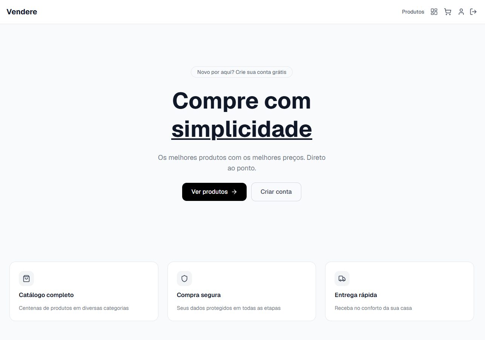
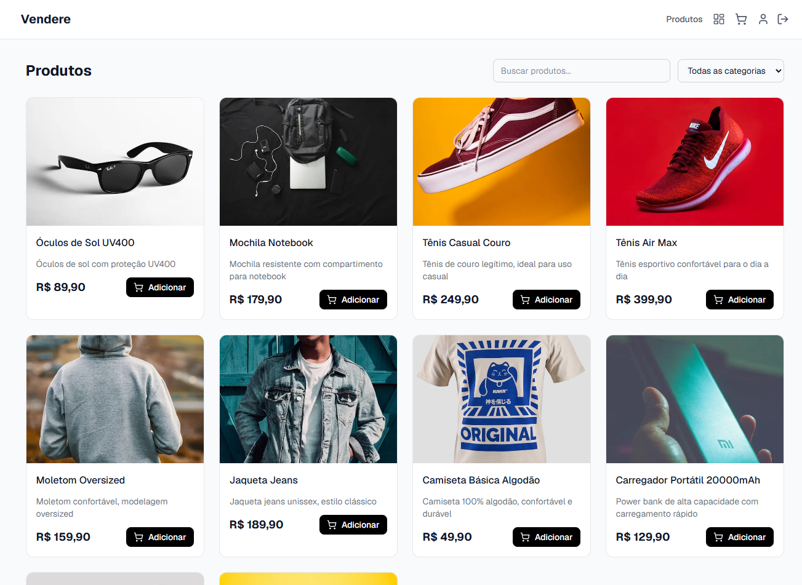
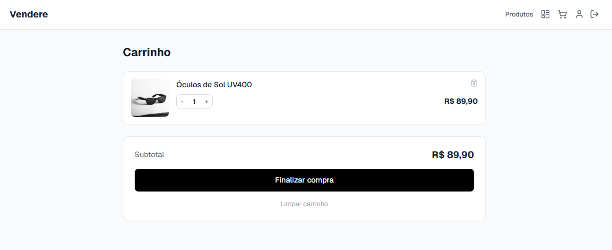
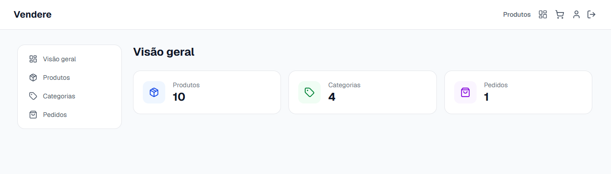

<h1 align="center">🛍️ Vendere</h1>

<p align="center">
  E-commerce fullstack construído do zero com <strong>Arquitetura Hexagonal</strong>, autenticação JWT com refresh token, e um catálogo completo de produtos, categorias e pedidos.
</p>

<p align="center">
  <a href="#-demo">Demo</a> ·
  <a href="#-stack">Stack</a> ·
  <a href="#-arquitetura">Arquitetura</a> ·
  <a href="#-funcionalidades">Funcionalidades</a> ·
  <a href="#-como-rodar">Como rodar</a>
</p>

<p align="center">
  
  
  
  
  
  
</p>

<br />

## 🚀 Demo

| | Link |
|---|---|
| 🌐 Frontend | [vendere.vercel.app](https://vendere-app.vercel.app/) |
| ⚙️ API | [vendere-api.railway.app](vendere-app-production.up.railway.app) |

<br />

## 📸 Screenshots

<p align="center">
  
  
</p>
<p align="center">
  
  
</p>

<br />

## 🧠 Sobre o projeto

O **Vendere** é um e-commerce completo construído para aplicar, na prática, conceitos de arquitetura de software que vão além do "CRUD básico". O foco principal não foi apenas fazer funcionar — foi fazer **de um jeito sustentável, testável e desacoplado de frameworks**.

O backend segue **Arquitetura Hexagonal (Ports & Adapters)**, isolando completamente as regras de negócio de detalhes de infraestrutura como banco de dados e HTTP. Isso significa que o núcleo da aplicação não sabe se está usando PostgreSQL, Express ou qualquer outra tecnologia específica — ele apenas conhece interfaces (`ports`), e quem implementa essas interfaces (`adapters`) fica isolado na camada de infraestrutura.

<br />

## ⚙️ Stack

### Backend
| Tecnologia | Uso |
|---|---|
| **Node.js + TypeScript** | Runtime e tipagem estática |
| **Express** | Framework HTTP |
| **PostgreSQL** | Banco de dados relacional |
| **Prisma** | ORM e migrations |
| **Zod** | Validação de dados e DTOs |
| **JWT** | Autenticação com access + refresh token |
| **bcryptjs** | Hash de senhas |
| **Pino** | Logs estruturados |
| **Helmet + express-rate-limit** | Segurança HTTP e rate limiting |
| **Vitest** | Testes unitários |
| **Docker** | Containerização do banco de dados |

### Frontend
| Tecnologia | Uso |
|---|---|
| **Next.js 14 (App Router)** | Framework React com SSR |
| **TypeScript** | Tipagem estática |
| **Tailwind CSS** | Estilização |
| **Zustand** | Gerenciamento de estado (carrinho, autenticação) |
| **React Hook Form + Zod** | Formulários e validação |
| **Axios** | Cliente HTTP com interceptors |
| **Sonner** | Notificações toast |

### Infraestrutura
| Serviço | Uso |
|---|---|
| **Railway** | Deploy do backend + PostgreSQL |
| **Vercel** | Deploy do frontend |
| **GitHub Actions** | CI com testes automatizados |

<br />

## 🏗️ Arquitetura

O backend é dividido em três camadas independentes:

```
src/
├── domain/            → Regras de negócio puras (entidades, interfaces de repositório)
├── application/       → Casos de uso (orquestram o domain)
└── infrastructure/    → Implementações concretas (Prisma, Express, JWT)
```

**Fluxo de uma requisição:**

```
HTTP Request
     ↓
Controller (infrastructure/http)
     ↓
Use Case (application)
     ↓
Repository Interface — Port (domain)
     ↓
Prisma Repository — Adapter (infrastructure/database)
     ↓
PostgreSQL
```

O `domain` nunca importa nada de `infrastructure`. Os casos de uso recebem repositórios por **injeção de dependência**, através de interfaces — isso significa que trocar o Prisma por outro ORM, ou o PostgreSQL por outro banco, não exigiria alterar nenhuma regra de negócio.

### Outros padrões aplicados

- **Mappers** — transformam o objeto cru do Prisma em entidades de domínio, evitando que detalhes de infraestrutura "vazem" para as camadas internas
- **DTOs com Zod** — toda entrada de dados é validada na borda da aplicação antes de chegar nos casos de uso
- **Repository Pattern** — acesso a dados sempre mediado por interfaces
- **Soft Delete** — produtos não são removidos do banco, apenas marcados como inativos
- **Snapshot de preço** — ao criar um pedido, o preço do produto naquele momento é salvo no item do pedido, preservando o histórico mesmo que o preço do produto mude depois

<br />

## ✨ Funcionalidades

### 👤 Autenticação
- Registro e login com JWT
- **Access token + refresh token** com rotação automática
- Logout com invalidação de sessão
- Middleware de proteção de rotas por papel (`CUSTOMER`, `SELLER`, `ADMIN`)

### 🛒 Loja
- Catálogo de produtos com busca, filtro por categoria e paginação
- Página de detalhe do produto
- Carrinho persistente (localStorage + Zustand)
- Checkout completo com criação de pedido
- Histórico de pedidos do usuário com acompanhamento de status

### 🔐 Painel administrativo
- CRUD completo de produtos e categorias
- Gestão de pedidos com atualização de status
- Visão geral com métricas (total de produtos, categorias e pedidos)

### 🛡️ Segurança e qualidade
- Rate limiting nas rotas de autenticação
- Helmet para hardening de headers HTTP
- Logs estruturados com Pino
- Variáveis de ambiente validadas com Zod (a aplicação não inicia se uma env obrigatória estiver ausente)
- CI com GitHub Actions rodando testes a cada push

<br />

## 📦 Como rodar localmente

### Pré-requisitos
- Node.js 20+
- Docker

### 1. Clone o repositório
```bash
git clone https://github.com/luc4sGabriel/vendere-app.git
cd vendere-app
```

### 2. Backend
```bash
cd backend
npm install
cp .env.example .env
docker compose up -d
npx prisma migrate dev
npm run seed
npm run dev
```

A API estará disponível em `http://localhost:3333`.

### 3. Frontend
```bash
cd frontend
npm install
cp .env.example .env.local
npm run dev
```

O frontend estará disponível em `http://localhost:3000`.

### 4. Testando a API

## 🧪 Testes

```bash
cd backend
npm test
```

<br />

## 📁 Estrutura de pastas (backend)

```
backend/
├── src/
│   ├── domain/
│   │   ├── user/
│   │   ├── product/
│   │   ├── category/
│   │   └── order/
│   ├── application/
│   │   ├── user/
│   │   ├── product/
│   │   ├── category/
│   │   └── order/
│   ├── infrastructure/
│   │   ├── database/
│   │   │   ├── mappers/
│   │   │   └── prisma-*.repository.ts
│   │   └── http/
│   │       ├── user/
│   │       ├── product/
│   │       ├── category/
│   │       ├── order/
│   │       └── middlewares/
│   └── shared/
│       ├── errors/
│       ├── middlewares/
│       ├── config/
│       └── utils/
└── prisma/
    ├── schema.prisma
    └── seed.ts
```

<br />

## 🗺️ Roadmap

- [x] Autenticação com refresh token
- [x] Arquitetura hexagonal completa
- [x] Dashboard administrativo
- [x] CI com GitHub Actions
- [x] Testes unitários nos use cases
- [ ] Fila assíncrona (BullMQ) para e-mails transacionais
- [ ] Webhook de confirmação de pagamento

<br />

## 👨‍💻 Autor

Feito por Lucas Gabriel

[LinkedIn](https://www.linkedin.com/in/lucas-gabriel-87a7351bb/) · [GitHub](https://github.com/luc4sGabriel)

<br />

<p align="center">⭐ Se este projeto te ajudou de alguma forma, considere deixar uma estrela!</p>